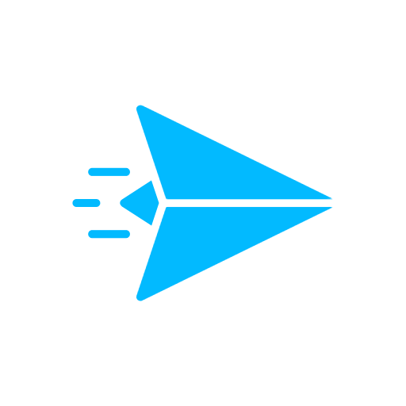

# SharpNng [](https://github.com/xoofx/SharpNng/actions) [](https://github.com/xoofx/SharpNng/actions) [](https://www.nuget.org/packages/SharpNng/)



SharpNng is a lightweight low-level managed wrapper around [NNG](https://nng.nanomsg.org/) a Lightweight Messaging Library.

> The current _native_ version of NNG used by SharpNng is `1.5.2`

## Features

- Strict mapping with the C API
- Pure DllImport library via `using static nng;`
- Compatible with `netstandard2.0+`.
- Fast interop with `Span` friendly API.

## Usage

- Install the [SharpNng](https://www.nuget.org/packages/SharpNng/) NuGet Package to your project.

```c#
using static nng;

// TBD
```

## Platforms

SharpNng is supported on the following platforms:

- `win-x64`, `win-x86`, `win-arm64`, `win-arm`
- `linux-x64`, `linux-arm64`, `linux-arm`
- `osx-x64`, `osx-arm64`

## How to Build?

You need to install the [.NET 6 SDK](https://dotnet.microsoft.com/download/dotnet/6.0). Then from the root folder:

```console
$ dotnet build src -c Release
```

In order to rebuild the native binaries, you need to run the build scripts from [ext](ext/readme.md)

## License

This software is released under the [BSD-Clause 2 license](https://opensource.org/licenses/BSD-2-Clause).

## Author

Alexandre Mutel aka [xoofx](https://xoofx.com).
